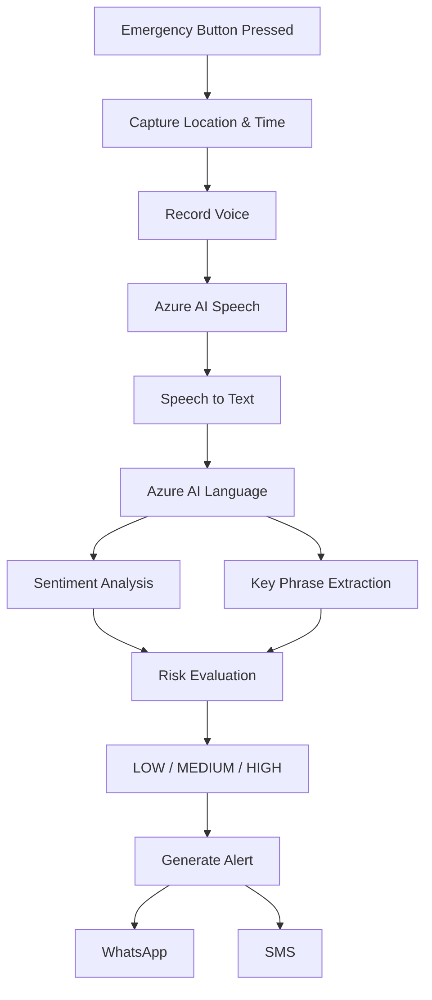

# 🛡️ HearMe – AI-Powered Personal Safety System

> An AI-powered personal safety application that analyzes emergency voice input, assesses risk using Azure AI services, and helps users quickly notify trusted contacts through WhatsApp or SMS during distress situations.

🌐 **Live Demo:** https://candid-concha-94703b.netlify.app/

💻 **GitHub Repository:** https://github.com/sakshi-kailas-pardhi/HearMe

## 📌 Problem

During emergency situations, people often struggle to communicate their condition, describe their location, or contact trusted people quickly. Valuable time can be lost while deciding what action to take.

## 💡 Solution

HearMe simplifies emergency response through a single emergency action.

After the user presses the **Emergency** button, the application:

- Captures the user's location and emergency time
- Records the user's voice
- Converts speech into text using Azure AI Speech
- Performs sentiment analysis and key phrase extraction using Azure AI Language
- Estimates the level of risk using a rule-based risk engine
- Generates a pre-filled emergency alert
- Allows the user to quickly notify trusted contacts through WhatsApp or SMS

  ## ✨ Features

- 🎤 Voice-based emergency reporting
- 📍 Automatic location capture
- 🧠 AI-powered speech-to-text conversion
- 😊 Sentiment analysis
- 🔑 Key phrase extraction
- 🚨 Rule-based risk assessment (LOW / MEDIUM / HIGH)
- 📱 One-click WhatsApp emergency alert
- 💬 One-click SMS emergency alert
- 🌐 Browser-based deployment using Netlify

  ## 🏗️ System Architecture

## 🛠️ Tech Stack

| Category | Technologies |
|----------|--------------|
| Frontend | React, Vite |
| AI Services | Azure AI Speech, Azure AI Language |
| Cloud | Firebase, Netlify |
| APIs | REST APIs |
| Language | JavaScript |

## 🖥️ Project Previews

<table width="100%">
  <tr>
    <td width="50%" align="center">
      <b>🏠 Homepage</b>  
      
    </td>
    <td width="50%" align="center">
      <b>🤖 AI Analysis</b>  
      
    </td>
  </tr>
  <tr>
    <td width="50%" align="center">
      <b>⚠️ Risk Assessment</b>  
      
    </td>
    <td width="50%" align="center">
      <!-- Leave this cell empty or put a brief project description/stats here to balance the 2x2 grid -->
      <b>✨ Key Features</b> 
      <ul align="left">
        <li>Real-time automated risk evaluation</li>
        <li>Intelligent AI-driven data analysis</li>
        <li>Clean, responsive user interface</li>
      </ul>
    </td>
  </tr>
</table>

---

## 🏗️ System Architecture

  

